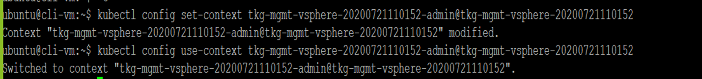

VMware Advanced Customer Engagements (ACE) Team

July 2020

How-to Change User or Password for Tanzu Kubernetes Grid (TKG) on vSphere
==================================


Table of Contents
=================

[Purpose 3](#purpose)

[Secrets And Credential information
3](#secrets-and-credential-information)

[Assumptions 4](#assumptions)

[Change User Password in vSphere 5](#change-user-password-in-vsphere)

[**Permissions Required** 5](#permissions-required)

[Update TKG clusters 11](#update-tkg-clusters)

[**TKG Config** 11](#tkg-config)

[**Management Cluster** 12](#management-cluster)

[**Bootstrap** 14](#bootstrap)

[**Cloud Provider** 17](#cloud-provider)

[**Storage Interface** 19](#storage-interface)

[**Workload Cluster** 22](#workload-cluster)

[Conclusion 23](#conclusion)

Purpose
=======

This document is a quick guide to change secrets in the TKG clusters in the below scenarios:
-	The password of the vSphere user used to create the TKG clusters has changed
-	A new user is setup and user needs to update in TKG clusters.

The document covers the following topics: 
-	Updating user password in vSphere
-	Updating secrets in the management cluster
-	Updating secrets in the workload clusters


Secrets and Credential information
==================================

**Capv manager bootstrap**
Cluster API bootstrap provider Kubeadm (CABPK) is a component of Cluster API that is responsible of generating a cloud-init script to turn a Machine into a Kubernetes Node; this implementation uses kubeadm for kubernetes bootstrap.


**Cloud Provider vSphere Credentials**
Kubernetes(K8s) Cloud Providers are an interface to integrate various node (i.e. hosts), load balancers and networking routes. This interface allows extending K8s to use various cloud and virtualization solutions as a base infrastructure to run on.

Kubernetes Cloud Providers provide the following interfaces to effectively integrate cloud platforms into Kubernetes:
-	Instances - interface for virtual machine management
-	Load Balancers - interface to integrate with load balancer provided by cloud platform
-	Routes - interface to add new routing rules of cloud platform
-	Zones - integrate with zones if implemented by cloud platform

CSI vSphere Config
Cloud Native Storage (CNS) provides comprehensive data management for stateful, containerized apps, enabling apps to survive restarts and outages. Stateful containers can use vSphere storage primitives such as standard volume, persistent volume, and dynamic provisioning, independent of VM and container lifecycle. 
The vSphere Container Storage Interface (CSI) driver is what enables Kubernetes clusters running on vSphere to provision persistent volumes on vSphere storage. The CSI driver will utilize the secret in the kube-system namespace.

Assumptions
===========

The following assumptions are made in this guide:

-   TKG cluster, both management and workload clusters are created as
    user user\@domain

Change User Password in vSphere 
===============================

This section goes through an overview of updating the user password in
vCenter for the user user\@domain.

**Permissions Required**
------------------------

The role that the user is assigned to requires the following
permissions.

The Required Permission for the TKG Roles Are:-

**Datastore**

-   Allocate space

-   Browse datastore

-   Low level file operations

 

**Network**

-   Assign network

**Resource**

-   Assign virtual machine to resource pool

 

**Sessions**

-   Message

-   Validate session

 

**Profile-driven storage**

-   Profile-driven storage view

 

**[vApp]{.underline}**

-   Import

 

**Virtual machine**

Configuration

-   Change Configuration

-   Add existing disk

-   Add new disk

-   Add or remove device

-   Advanced configuration

-   Change CPU count

-   Change Memory

-   Change Settings

-   Configure Raw device

-   Extend virtual disk

-   Modify device settings

-   Remove disk

-   Create from existing

-   Remove

**Interaction \>**

-   Power off

-   Power on

 

**Provisioning \>**

-   Deploy template

The Objects that we need to assign the user with the TKG role are

-   The Deployed  TKG OVF templates

-   The vCenter 

-   Datacenters or datacenter folders 

-   Datastores or datastore folders 

-   Hosts and  clusters.

-   TKG resource pools  (With Propagate to children)

-   Networks to which clusters will be assigned \>\>\> In my case it was
    the \"DSwitch-Management\" Distributed Port Group.

-   The Distributed Switch

-   The TKG VM and Template folders (With Propagate to children)

**Step 1:** Login to vCenter and from the menu select Administration


**\
**

**Step 2:** Select Users and Groups


**Step 3:** Select the domain


**\
**

**Step 4:** Click on the 3 dots and click on edit


**Step 5**: Change the password E.g. VMware4!


 

**\
**

**Step 6**: Log out and login to the vCenter as the user and the new
password


**Step 7**: Make sure the login works as expected


**Step 8**: Verify that the user has the roles defined above.

Update TKG clusters
===================

This section goes through the steps to update the credentials on the TKG
clusters.

**TKG Config**
--------------

**Step 1:** Encode the new password to base64

> [[https://www.base64encode.org/]](https://www.base64encode.org/)
>
> E.g. VMware4! translates to Vk13YXJlNCE=

**Step 2 :** Change the password in the tkg config file

> cd \~/.tkg

Open the config.yaml file and change the value of the VSPHERE\_PASSWORD
with the new password from above.

If the user needs to be changed VSPHERE\_USERNAME and the corresponding
password needs to be edited.


**Management Cluster**
----------------------

The management cluster contains three secrets that needs to be updated
with the new password

>capv-manager-bootstrap-credentials in the namespace capv-system
>
>cloud-provider-vsphere-credentials in the kube-system namespace
>
>csi-vsphere-config in the kube-system namespace

**Step 1:** Get all tkg clusters

> tkg get cluster \--include-management-cluster


NOTE: The versions of k8 is v1.17.3

**Step 2:** Get the management cluster

>tkg get mc


**Step 3:** Set the management context

> tkg set mc \<management-cluster-name\>
>
> E.g. tkg set mc tkg-mgmt-vsphere-20200721110152


**Step 3:** Use the kubectl context to the management cluser

> kubectl config get-contexts


>kubectl config use-context
>
>tkg-mgmt-vsphere-20200721110152-admin\@tkg-mgmt-vsphere-20200721110152



**Step 4:** Check for namespaces in the management cluster

> kubectl get ns


NOTE: The management cluster contains the capi\* and the cap\*
namespaces

### **Bootstrap** 

**Step 5:** The capv-system namespace contains the
capv-manager-bootstrap-credentials secret which is used to bootstrap the
workload clusters

> kubectl get secrets -n capv-system


> kubectl describe secret capv-manager-bootstrap-credentials -n
capv-system


Note: The data references the credentials.yaml file

**Step 6:** View contents of the credentials.yaml file

> kubectl -n capv-system get secret capv-manager-bootstrap-credentials -o
jsonpath=\"{.data.credentials\\.yaml}\" \| base64 -d


**Step 7:** Copy the contents to a file locally and name its
credentials.yaml

> kubectl -n capv-system get secret capv-manager-bootstrap-credentials -o
jsonpath=\"{.data.credentials\\.yaml}\" \| base64 -d \> credentials.yaml

Note the \' on the values

**Step 8:** Change the password to the updated password

<details><summary>credentials.yaml</summary>

```yaml
username: 'riaz@vsphere.local'
password: 'VMware4!'
```
</details>
<br/>


NOTE: If the user needs to be changed update the file with the username
and the corresponding password

**Step 9:** Delete the capv-manager-bootstrap-credentials secret

> kubectl delete secret capv-manager-bootstrap-credentials -n capv-system


**Step 10:** Create the capv-manager-bootstrap-credentials secret with
the updated credentials file

> kubectl -n capv-system create secret generic
capv-manager-bootstrap-credentials \--from-file=credentials.yaml

**Step 11:** Verify that the newly created secret contains the right
credentials

> kubectl -n capv-system get secret capv-manager-bootstrap-credentials -o
jsonpath=\"{.data.credentials\\.yaml}\" \| base64 -d


NOTE: The password field reflects the correct password


### 

### **Cloud Provider** 

**Step 12:** The kube-system namespace contains the cloud provider
secret, which is used to authenticate against vCenter

> kubectl get secret cloud-provider-vsphere-credentials -o yaml -n
kube-system


NOTE: The password is base 64 encoded

To decode the password in unix use the command echo \<password\>
\| base64 -d

**Step 13:** Encode the new password to base64

[[https://www.base64encode.org/]](https://www.base64encode.org/)

> E.g. VMware4! translates to Vk13YXJlNCE=

NOTE: If the user needs to be changed the username needs to be encoded
along with the corresponding password.

**Step 14:** Update the password for the cloud provider secret

> kubectl edit secret cloud-provider-vsphere-credentials -n kube-system

Update the password to the one generated in the step above

NOTE: If the user needs to be changed the username needs to be update
the username as well.

**Step 15:** Make sure that the password reflects the new base 64
encoded format

> kubectl get secret cloud-provider-vsphere-credentials -n kube-system -o
yaml

### **Storage Interface** 

**Step 16:** The kube-system namespace contains the storage interface
secret, which is used to authenticate against vCenter to provision
storage for PV's

> kubectl -n kube-system describe secret csi-vsphere-config


NOTE: The secret references csi-vsphere.conf

**Step 16:** The kube-system namespace contains the storage interface
secret, which is used to authenticate against vCenter to provision
storage for PV's

> kubectl -n kube-system get secret csi-vsphere-config -o
jsonpath=\"{.data.csi-vsphere\\.conf}\" \| base64 -d


**Step 17:** Save the contents of the file to csi-vsphere.conf

> kubectl -n kube-system get secret csi-vsphere-config -o
jsonpath=\"{.data.csi-vsphere\\.conf}\" \| base64 -d \> csi-vsphere.conf

**Step 17:** Edit the contents of csi-vsphere.conf and change the
password to the new password

<details><summary>csi-vsphere.conf</summary>

```yaml
[Global]

insecure-flag = true

cluster-id = "tkg-system/tkg-mgmt-vsphere-20200721110152"

[VirtualCenter "vcsa-01a.corp.local"]

user = "riaz@vsphere.local"

password = "VMware4!"

datacenters = "RegionA01"

[Network]


public-network = "DSwitch-Management"
```
</details>
<br/>


NOTE: If the user needs to be changed the username needs to be updated
along with the corresponding password

**Step 18:** Delete the existing csi-vsphere-config secret

> kubectl delete secret csi-vsphere-config -n kube-system


**Step 19:** Create the csi-vsphere-config in the kube-system namespace
from the updated csi-vsphere.conf file

> kubectl -n kube-system create secret generic csi-vsphere-config
\--from-file=csi-vsphere.conf


**Workload Cluster**
--------------------

The workload cluster contains two secrets that needs to be updated with
the new password

cloud-provider-vsphere-credentials in the kube-system namespace

csi-vsphere-config in the kube-system namespace

**Step 1:** Change the context to reference the workload cluster

> kubectl config get-contexts


> kubectl config use-context riaz-workload-admin\@riaz-workload


> kubectl get ns


NOTE: cap\* namespaces do not exist

**Step 2: Follow steps 12 to 19 from the Management Cluster steps**

Conclusion
==========

We hope this document was useful. As you try these configuration steps,
please provide any feedback or questions in the comments section for
this document on code.vmware.com. Also, do let us know if you have any
suggestions or if you would like to see guidance on other topics.
